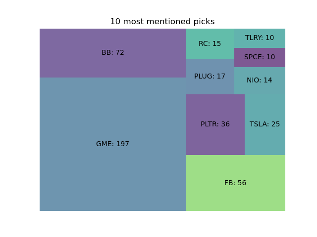
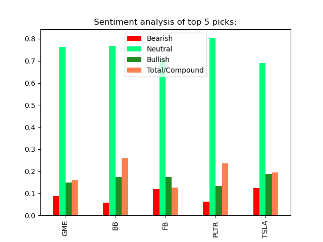

# reddit-sentiment-analysis
This program goes thru reddit, finds the most mentioned tickers and uses Vader SentimentIntensityAnalyzer to calculate the ticker compound value.  

IMPORTANT: I took most of the code from this [repo](https://github.com/asad70/reddit-sentiment-analysis).

## Program Parameters
<pre>
subs = []           sub-reddit to search
post_flairs = {}    posts flairs to search || None flair is automatically considered
goodAuth = {}       authors whom comments are allowed more than once
uniqueCmt = True    allow one comment per author per symbol
ignoreAuthP = {}    authors to ignore for posts
ignoreAuthC = {}    authors to ignore for comment 
upvoteRatio = float upvote ratio for post to be considered, 0.70 = 70%
ups = int           define # of upvotes, post is considered if upvotes exceed this #
limit = int         define the limit, comments 'replace more' limit
upvotes = int       define # of upvotes, comment is considered if upvotes exceed this #
picks = int         define # of picks here, prints as "Top ## picks are:"
picks_ayz = int     define # of picks for sentiment analysis
</pre>

## Sample Output
It took 216.65 seconds to analyze 5862 comments in 80 posts in 4 subreddits.

Posts analyzed saved in titles

10 most mentioned picks:\
GME: 197\
BB: 72\
FB: 56\
PLTR: 36\
TSLA: 25\
PLUG: 17\
RC: 15\
NIO: 14\
SPCE: 10\
TLRY: 10

&nbsp; &nbsp; &nbsp; &nbsp; Bearish &nbsp; Neutral &nbsp; Bullish &nbsp; Total/Compound\
GME    &nbsp; 0.087    &nbsp;0.763    &nbsp; &nbsp;0.150           &nbsp; &nbsp; &nbsp;0.161\
BB     &nbsp; 0.058 &nbsp;   0.768 &nbsp; &nbsp;   0.175           &nbsp; &nbsp; &nbsp;0.261\
FB     &nbsp; 0.119    &nbsp;0.708    &nbsp; &nbsp;0.173           &nbsp; &nbsp; &nbsp;0.127\
PLTR    &nbsp;0.062    &nbsp;0.804 &nbsp; &nbsp;   0.134           &nbsp; &nbsp; &nbsp;0.235\
TSLA    &nbsp;0.124    &nbsp;0.690    &nbsp; &nbsp;0.187           &nbsp; &nbsp; &nbsp;0.195\

## Data:
Includes US stocks with market cap > 100 Million, and price above $3. It doesn't include penny stocks.\
You can download data from here:\
Source (US stocks):  https://www.nasdaq.com/market-activity/stocks/screener?exchange=nasdaq&letter=0&render=download\

Implementation:
I am using sets for 'x in s' comparison, sets time complexity for "x in s" is O(1) compare to list: O(n).

Limitations:
It depends mainly on the defined parameters for current implementation:
It completely ignores the heavily downvoted comments, and there can be a time when
the most mentioned ticker is heavily downvoted, but you can change that in upvotes variable.

